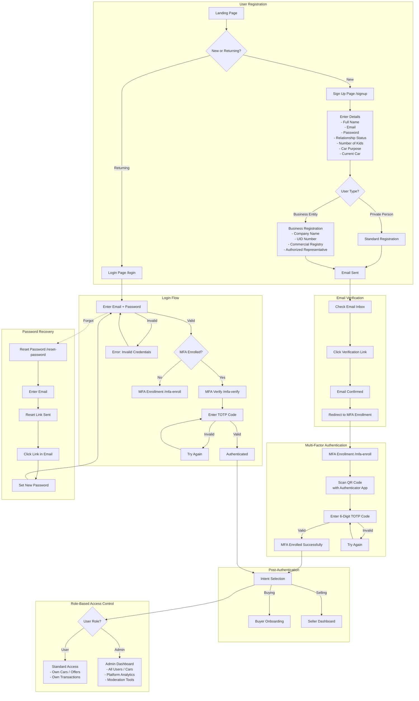

# Authentication Flow — Registration, Login & Security

This diagram maps the complete authentication journey including registration, email verification, MFA enrollment, and role-based access control.

---

## Security Features Summary

| Feature | Implementation |
|---------|---------------|
| **Password** | Secure hashing via auth provider |
| **Email Verification** | Required before first login |
| **MFA (TOTP)** | Required for all users, authenticator app |
| **Session Management** | JWT tokens with refresh |
| **Rate Limiting** | Brute-force protection on login |
| **Password Reset** | Email-based secure reset flow |
| **RBAC** | Separate user_roles table, security definer function |
