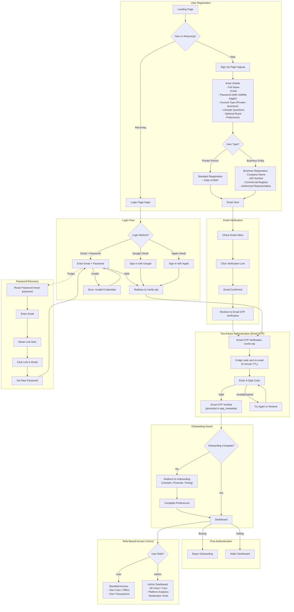

# Authentication Flow — Registration, Login & Security

This diagram maps the complete authentication journey including registration, email verification, Email OTP 2FA, social login, onboarding guard, and role-based access control.

---

## Authentication Methods

| Method | Page | Details |
|--------|------|---------|
| **Email + Password** | Signup (`/signup`) | Standard registration with password visibility toggle |
| **Email + Password** | Login (`/login`) | Credentials-based login |
| **Google OAuth** | Login (`/login`) | Social sign-in via Google |
| **Apple OAuth** | Login (`/login`) | Social sign-in via Apple |

> **Note:** OAuth buttons (Google, Apple) are only available on the **Login** page. The **Signup** page uses email/password only to ensure users complete lifestyle profiling during registration.

## Onboarding Guard

All users — including those signing in via Google or Apple — must complete the onboarding questionnaire before accessing the dashboard. The guard checks the `user_preferences` table for `onboarding_completed = true`. If not complete, the user is redirected to `/onboarding`.

## Security Features Summary

| Feature | Implementation |
|---------|---------------|
| **Password** | Secure hashing via auth provider; visibility toggle on signup |
| **Email Verification** | Required before first login |
| **2FA (Email OTP)** | 6-digit code via email, 5-minute TTL, rate-limited (5 requests / 10 min) |
| **Session Management** | JWT tokens with refresh; OTP verified status in `app_metadata` |
| **Rate Limiting** | Brute-force protection on login + OTP rate limiting |
| **Password Reset** | Email-based secure reset flow |
| **RBAC** | Separate `user_roles` table, `has_role()` security definer function |
| **Social Auth** | Google + Apple OAuth on login page |
