# Buyer Journey — Complete Process Flow

This diagram maps every step a buyer goes through on Autozon, from sign-up to car acquisition.

```mermaid
flowchart TD
    subgraph AUTH["Authentication"]
        A1[Landing Page] --> A2[Sign Up - Email + Password]
        A2 --> A3["Profile Creation\n- Full Name\n- Relationship Status\n- Number of Kids\n- Car Purpose\n- Current Car"]
        A3 --> A4[Email Verification]
        A4 --> A5[MFA Enrollment - TOTP]
        A5 --> A6[MFA Verify Code]
    end

    subgraph INTENT["Intent Selection"]
        A6 --> I1[Intent Selection Page]
        I1 -->|Buying| O1[Onboarding]
        I1 -->|Selling| SD[Seller Dashboard]
    end

    subgraph ONBOARDING["Buyer Onboarding - 12-Step Preferences"]
        O1 --> O2["Budget Range\n- Min / Max EUR"]
        O2 --> O3["Preferred Makes\n- Multi-select Brands"]
        O3 --> O4["Preferred Fuel Types\n- Petrol / Diesel /\n  Electric / Hybrid"]
        O4 --> O5["Preferred Body Types\n- SUV / Sedan / Hatch /\n  Coupe / Wagon / Van"]
        O5 --> O6["Transmission\n- Manual / Automatic"]
        O6 --> O7["Year Range / Mileage /\n  Power Preferences"]
        O7 --> O8["Commute Distance /\n  Parking / Insurance\n  Family Size / Timing"]
        O8 --> O9["Sports & Activities\n- Multi-select 10 options\n- Cycling, Skiing, Surfing,\n  Golf, Tennis, Running,\n  Hiking, Camping,\n  Motorsports, Fitness"]
        O9 --> O10["Towing Requirements\n- Toggle On/Off\n- Weight: 750–3500 kg"]
        O10 --> CS1[Car Selection]
    end

    subgraph SELECTION["Car Selection - Swipe Phase"]
        CS1 --> CS2["Cars Ranked by\n5D Match Score:\n- 25% Lifestyle\n- 25% Financial\n- 20% Preference\n- 10% Condition\n- 20% Sports & Towing"]
        CS2 --> CS3["Browse Car Cards\n- Photo / Price / Details\n- Match Score Badge\n- Like or Skip"]
        CS3 -->|Like| CS4[Add to Liked List]
        CS3 -->|Skip| CS3
        CS4 --> CS5{Narrow Down?}
        CS5 -->|More Cars| CS6["Show More\n- Next Batch Loaded\n- Lifestyle Scored"]
        CS6 --> CS3
        CS5 -->|Yes| CS7{How Many Liked?}
        CS7 -->|3+ Cars| CS8["Filtered to\nLiked Only\n- Continue Narrowing"]
        CS7 -->|2 Cars| CC1[Car Comparison]
        CS7 -->|1 Car| CD1[Car Detail]
    end

    subgraph COMPARE["Car Comparison"]
        CC1 --> CC2["Side-by-Side View\n- Price / Fair Value\n- Year / Mileage / Power\n- Fuel / Transmission\n- Condition Score\n- Equipment List\n- Match Score"]
        CC2 -->|Choose One| CD1
    end

    subgraph DETAIL["Car Detail Page"]
        CD1 --> CD2["Full Listing View\n- Photo Gallery\n- All Specifications\n- Equipment List\n- Seller Inspection Report\n- Fair Value vs Price\n- Market Comparison\n- Vincario VIN Report"]
        CD2 -->|Shortlist| SL1["Added to Shortlist\n- Stored in car_shortlists\n- Toast Notification"]
        CD2 -->|Start Trade| N1["Navigate to\nBuyer Matches\n- Make Offer"]
    end

    subgraph OFFER["Making an Offer"]
        N1 --> N2["Offer Dialog\n- Enter Amount EUR\n- Optional Message"]
        N2 --> N3[Offer Created in DB]
        N3 --> NEG1[Negotiation Page]
    end

    subgraph NEGOTIATION["Negotiation Engine"]
        NEG1 --> NE1["Multi-Round Negotiation\n- Max 5 Rounds\n- Fair Value Reference\n- Realtime Updates"]
        NE1 -->|Seller Counters| NE2["Counter-Offer Received\n- Accept / Reject / Counter"]
        NE2 --> NE1
        NE1 -->|Accepted| NE3["Deal Agreed\n- Download PDF\n- Proceed to Acquire"]
        NE1 -->|Rejected| NE4["Deal Ended\n- Browse More Cars"]
    end

    subgraph TRANSACTION["Transaction Wizard - 5 Steps"]
        NE3 --> T1["Step 1: Choose Method\n- Digital Recommended\n- Manual Offline"]
        T1 -->|Digital| T2["Step 2: Contract\n- Country Auto-detect\n- OEAMTC or ADAC\n- Review Clauses\n- Sign Digitally"]
        T1 -->|Manual| TM["Manual Path\n- Download Template\n- Offline Checklist"]
        T2 --> T3["Step 3: Payment\n- Wire Transfer\n- Credit Card\n- Bank Financing\n- Leasing\n- Financing Calculator"]
        T3 --> T4["Step 4: Insurance\n- Haftpflicht / Teilkasko /\n  Vollkasko\n- Insurance Calculator\n- Integration Roadmap\n- Or Skip"]
        T4 --> T5["Step 5: Complete\n- Summary of Deal\n- Next Steps\n- Car Marked SOLD"]
        TM --> T5
    end

    subgraph KYC["Identity Verification"]
        T2 -.->|Required| KYC1["KYC Flow /kyc\n- ID Upload (front/back)\n- Selfie with ID\n- Address Verification"]
        KYC1 -.-> KYC2["Status: Pending → Verified"]
    end

    subgraph DASHBOARD["Buyer Dashboard"]
        T5 --> BD1["Dashboard - Buyer Tab\n- My Offers List\n- Shortlisted Cars\n- Active Acquisitions\n- Search Preferences\n- Quick Actions"]
        BD1 -->|Edit Preferences| O1
        BD1 -->|Browse More| CS1
        BD1 -->|Recommendations| R1["AI Next Car\nRecommendations"]
    end
```

---

## Key Stages Summary

| Stage | Steps | Key Actions |
|-------|-------|-------------|
| **Authentication** | 6 | Sign up with lifestyle profile, email verify, MFA |
| **Intent Selection** | 1 | Choose Buying or Selling path |
| **Onboarding** | 12 | Budget, makes, fuel, body, transmission, year, mileage, power, commute, lifestyle, sports, towing |
| **Car Selection** | 3+ rounds | Browse 5D-scored cards, like/skip, narrow down |
| **Comparison** | 1 | Side-by-side feature comparison |
| **Car Detail** | 1 | Full listing + Vincario VIN report, shortlist, or start trade |
| **Offer** | 1 | Submit offer amount + message |
| **Negotiation** | 1-5 rounds | Counter-offers until agreement |
| **KYC** | 3 | ID upload, selfie, address — required for contract signing |
| **Transaction** | 5 | Method, contract, payment (with financing calculator), insurance (with estimate calculator), complete |
| **Dashboard** | Ongoing | Manage offers, shortlists, acquisitions |
