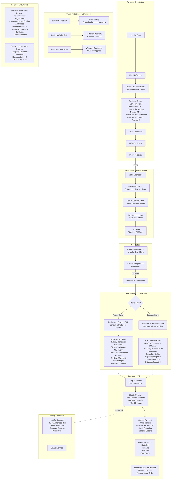

# Dealer / Business Seller Flow — B2P & B2B Transactions

This diagram maps the complete journey for business sellers (dealers, Unternehmen, Haendler) including registration, listing, and role-specific legal frameworks.

---

## Legal Framework Summary

| Scenario | Seller | Buyer | Warranty | Key Law |
|----------|--------|-------|----------|---------|
| **P2P** | Private | Private | Excluded (Gewaehrleistungsausschluss) | ABGB |
| **B2P** | Business | Private | 24 months mandatory | KSchG (Consumer Protection) |
| **P2B** | Private | Business | Excluded, no consumer protection | ABGB |
| **B2B** | Business | Business | Excludable by agreement | UGB 377 |

## Business Registration Fields

| Field | Required | Format |
|-------|----------|--------|
| Company Name | Yes | Free text |
| UID Number | Yes | ATU + 8 digits |
| Commercial Registry Number | Yes | FN + number |
| Authorized Representative | Yes | Full name |
