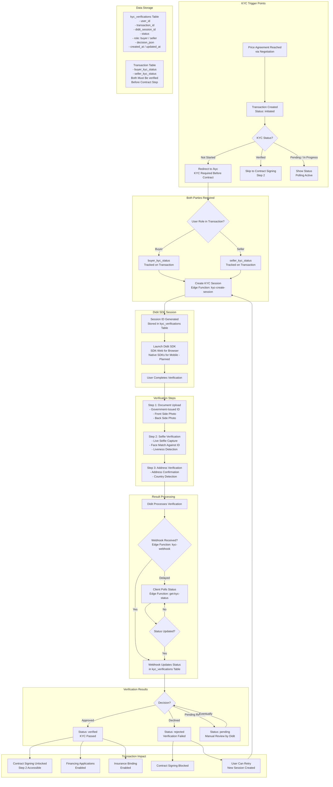

# KYC Verification Flow — Identity Verification via Didit SDK

This diagram maps the complete KYC (Know Your Customer) identity verification process, from trigger to verified status, including the Didit SDK integration and webhook synchronization.

---

## KYC Status Lifecycle

| Status | Meaning | Next Action |
|--------|---------|-------------|
| **not_started** | User has not begun verification | Redirect to /kyc |
| **pending** | Session created, awaiting completion | User completes SDK flow |
| **in_progress** | Verification submitted, processing | Await webhook / poll |
| **verified** | Identity confirmed by Didit | Proceed to contract |
| **rejected** | Verification failed | Retry with new session |

## Integration Architecture

| Component | Implementation |
|-----------|---------------|
| **SDK** | Didit SDK-Web (browser), native SDKs planned for mobile |
| **Session Creation** | Edge function `kyc-create-session` |
| **Result Delivery** | Webhook via `kyc-webhook` edge function |
| **Fallback Sync** | Client polling via `get-kyc-status` edge function |
| **Storage** | `kyc_verifications` table with RLS (own records only, admin full access) |
| **Blocking** | Contract signing gated on both buyer + seller KYC verified |

## Role-Specific Requirements

| User Type | Documents Required |
|-----------|-------------------|
| **Private Person** | Government ID (front + back) + Selfie + Address |
| **Business Entity** | Authorized representative's ID + Selfie + Company address verification |
