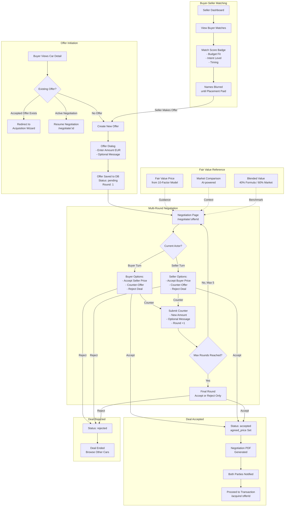

# Negotiation Flow — Offer to Agreement

This diagram maps the complete negotiation engine from initial offer through multi-round countering to final agreement or rejection.

---

## Negotiation Rules

| Rule | Value |
|------|-------|
| **Max Rounds** | 5 (configurable per offer, default 3) |
| **Fair Value Reference** | Always visible during negotiation |
| **Offer Validation** | Buyer cannot offer on own car |
| **Round Tracking** | Each action logged with actor, role, amount, message |
| **Status Transitions** | pending → countered → accepted / rejected |
| **PDF Export** | Available after acceptance |
| **Realtime Updates** | Both parties see live status changes |
