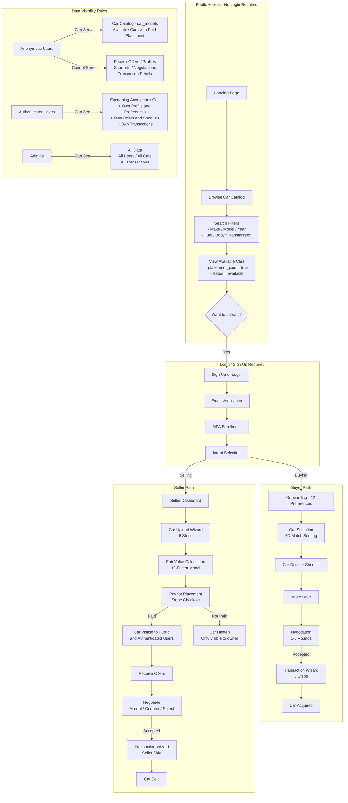

# Public Access Flow — Unauthenticated User Journey

This diagram shows what anonymous visitors can access without creating an account, and when authentication is required.

---

## Key Visibility Summary

| Resource | Anonymous | Authenticated | Admin |
|----------|-----------|---------------|-------|
| **Car Catalog (car_models)** | Read | Read | Read |
| **Available Cars (placement paid)** | Read | Read | Full |
| **Unpaid / Draft Cars** | Hidden | Owner only | Full |
| **Profiles** | Hidden | Own only | Full |
| **Offers / Negotiations** | Hidden | Participant only | Full |
| **Transactions** | Hidden | Participant only | Full |
| **Shortlists** | Hidden | Own + car owner | Full |
