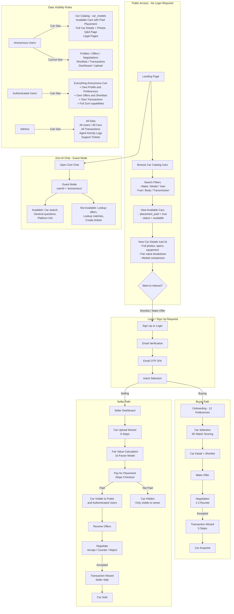

# Public Access Flow — Unauthenticated User Journey

This diagram shows what anonymous visitors can access without creating an account, and when authentication is required.

---

## Key Visibility Summary

| Resource | Anonymous | Authenticated | Admin |
|----------|-----------|---------------|-------|
| **Car Catalog (car_models)** | Read | Read | Read |
| **Available Cars (placement paid)** | Read | Read | Full |
| **Car Detail Page** | Read | Read | Full |
| **Unpaid / Draft Cars** | Hidden | Owner only | Full |
| **Profiles** | Hidden | Own only | Full |
| **Offers / Negotiations** | Hidden | Participant only | Full |
| **Transactions** | Hidden | Participant only | Full |
| **Shortlists** | Hidden | Own + car owner | Full |
| **Zoni AI Chat** | Guest (search + FAQ only) | Full (all tools) | Full |
| **Support Tickets** | Hidden | Own only | Full |
| **Agent Activity Logs** | Hidden | Hidden | Full |

## RLS Enforcement

Anonymous access is enforced through Row-Level Security policies:
- `cars` table: `anon` role can SELECT where `status = 'available' AND placement_paid = true`
- `car_models` table: `anon` role can SELECT all rows
- `cars_public` view uses `security_invoker = true` to enforce RLS
- Storage: `anon` users can upload to `temp/` prefix in `car-images` bucket (for Sell Wizard pre-auth uploads)

---

*Document status: V2 — Updated April 2026 with anonymous browsing, Zoni guest mode, and storage access rules.*
