# Seller Journey — Complete Process Flow

This diagram maps every step a seller goes through on Autozon, from sign-up to a completed sale.

```mermaid
flowchart TD
    subgraph AUTH["Authentication"]
        A1[Landing Page] --> A2[Sign Up - Email + Password]
        A2 --> A3[Email Verification]
        A3 --> A4[MFA Enrollment - TOTP]
        A4 --> A5[MFA Verify Code]
    end

    subgraph INTENT["Intent Selection"]
        A5 --> I1[Intent Selection Page]
        I1 -->|Selling| S1[Dashboard - Seller Tab]
        I1 -->|Buying| B1[Onboarding]
    end

    subgraph UPLOAD["Car Upload Wizard - 6 Steps"]
        S1 -->|List a Car| U1["Step 1: Basic Info\n- VIN Decode auto-fill\n- Make / Model / Year\n- Fuel / Transmission / Body\n- Power HP / Mileage / Color"]
        U1 --> U2["Step 2: Photos\n- 8 Required Slots\n  front, rear, left, right,\n  interior, dashboard,\n  engine, trunk\n- Extra Photos optional"]
        U2 --> U3["Step 3: Condition\n- Exterior Grade 1-4\n- Interior Grade 1-4\n- Accident History Y/N\n- Smoker / Maintenance\n- Service Book / Docs"]
        U3 --> U4["Step 4: Inspection Checklist\n- 20-Point Self-Report\n- Exterior 5 items\n- Interior 6 items\n- Mechanical 5 items\n- Test Drive 4 items\n- YES = Good / NO = Issue"]
        U4 --> U5["Step 5: Equipment\n- Safety Features\n- Tech Features\n- Comfort Features\n- Roof Rack / Box\n- Second Wheel Set"]
        U5 --> U6["Step 6: AI Damage Scan\n- Photos sent to AI\n- Damage Detection\n- Repair Cost Estimates\n- Confirm or Dismiss each"]
    end

    subgraph VALUATION["Fair Value Calculation"]
        U6 --> V1["calculateFairValue Engine"]
        V1 --> V2["10-Factor Model:\n1. Reference MSRP\n2. Depreciation Curve\n3. Mileage Factor\n4. Condition Factor\n5. Damage Cost Deduction\n6. Equipment Value Index\n7. Market Position\n8. Regional Demand\n9. Transparency Bonus\n10. Inspection Penalty"]
        V2 --> V3["Fair Value Result Page\n- Formula Value\n- AI Market Comparison\n- Blended Value 40/60\n- Appraisal Breakdown"]
        V3 -->|Accept AI Value| V4[Car Listed at Fair Value]
        V3 -->|Override Price| V5["Custom Price\n- Deviation % shown"]
        V5 --> V4
    end

    subgraph DASHBOARD["Seller Dashboard"]
        V4 --> D1["Dashboard Overview\n- Portfolio Value\n- Avg Condition Score\n- Total Views\n- Active Offers"]
        D1 --> D2["My Cars List\n- Status Badge\n- Views / Shortlists\n- Edit / Delete"]
        D2 -->|Boost Listing| P1["Stripe Checkout\n- Premium Placement\n- Higher Visibility"]
        P1 --> P2[Placement Confirmed]
        D2 -->|View Matches| M1[Buyer Matches Page]
    end

    subgraph MATCHES["Buyer Matches"]
        M1 --> M2["Seed Buyers Listed\n- Match Score Badge\n- Budget / Intent / Timing\n- Names Blurred until Paid"]
        M2 -->|Make Offer| N1[Create Offer Dialog]
        N1 --> N2[Negotiation Page]
    end

    subgraph NEGOTIATION["Negotiation Engine"]
        N2 --> NE1["Multi-Round Negotiation\n- Max 5 Rounds Default\n- Fair Value as Reference\n- Offer / Counter-Offer"]
        NE1 -->|Accepted| NE2["Agreement Reached\n- Download PDF\n- Proceed to Transaction"]
        NE1 -->|Rejected| NE3["Deal Ended\n- Browse Other Options"]
        NE1 -->|Counter| NE1
    end

    subgraph TRANSACTION["Transaction Wizard - 5 Steps"]
        NE2 --> T1["Step 1: Choose Method\n- Digital Recommended\n- Manual Offline"]
        T1 -->|Digital| T2["Step 2: Contract\n- Auto-detect Country\n- AT = OEAMTC\n- DE = ADAC\n- Digital Signature\n- Download PDF"]
        T1 -->|Manual| TM["Manual Checklist\n- Download Contract Template\n- OEAMTC / ADAC Links\n- Deal Summary PDF"]
        T2 --> T3["Step 3: Payment\n- Wire Transfer\n- Credit Card max 10K EUR\n- Financing with Partners\n- Leasing with Partners"]
        T3 --> T4["Step 4: Insurance\n- Haftpflicht Liability\n- Teilkasko Partial\n- Vollkasko Comprehensive\n- Skip Option"]
        T4 --> T5["Step 5: Complete\n- Ownership Transfer Checklist\n- 7 Manual Steps (Austrian Order)\n- All Deadlines from Signing\n- Buyer + Seller in Parallel\n- Car Status = SOLD"]
        TM --> T5
    end

    subgraph SOLD["Post-Sale"]
        T5 --> SO1["Car Status: SOLD\n- Red SOLD Badge\n- No Edit / Delete\n- Transaction Link\n- Filtered from Active"]
        SO1 --> SO2["Seller Completion View\n- Different congrats image\n- 'Find your next car'\n- Ownership badge"]
    end
```

---

## Key Stages Summary

| Stage | Steps | Key Actions |
|-------|-------|-------------|
| **Authentication** | 5 | Sign up, email verify, MFA enroll + verify |
| **Intent Selection** | 1 | Choose Selling or Buying path |
| **Car Upload** | 6 | Basic info, photos, condition, inspection, equipment, AI damage scan |
| **Valuation** | 3 | Fair value engine, market comparison, accept or override price |
| **Dashboard** | 2 | Portfolio overview, manage listings |
| **Buyer Matches** | 2 | View matched buyers, make offers |
| **Negotiation** | 1-5 rounds | Offer/counter until accepted or rejected |
| **Transaction** | 5 | Method, contract, payment, insurance, complete |
| **Post-Sale** | 1 | Car marked SOLD, actions locked |
