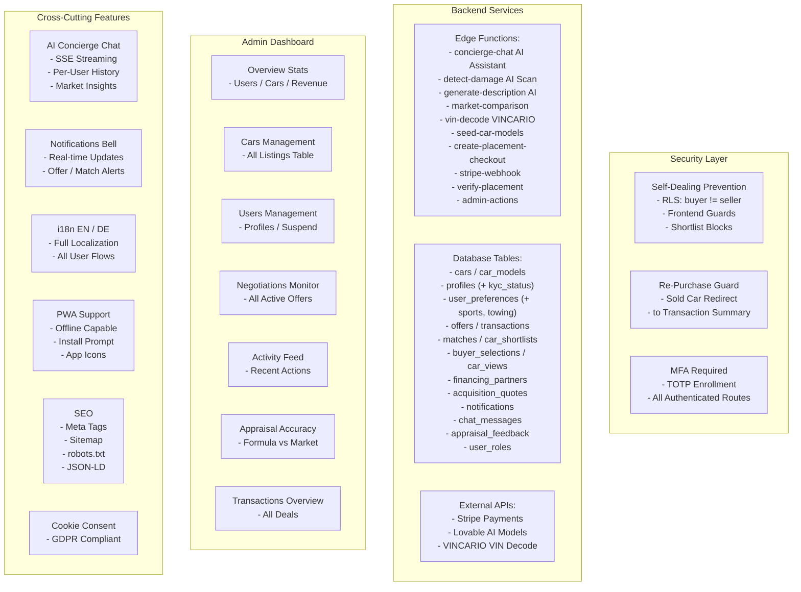

# System Architecture Overview

This diagram provides a high-level view of Autozon's backend services, security layer, admin capabilities, and cross-cutting features.

---

## Edge Functions Detail

| Function | Purpose | Integration |
|----------|---------|-------------|
| `concierge-chat` | AI assistant for user support | Lovable AI (Gemini) |
| `detect-damage` | Photo-based damage detection | Lovable AI (Gemini Vision) |
| `generate-description` | Auto-generate car listing text | Lovable AI |
| `market-comparison` | Fetch comparable market data | Lovable AI |
| `vin-decode` | Decode VIN for auto-fill | VINCARIO API |
| `seed-car-models` | Populate car model database | Lovable AI |
| `create-placement-checkout` | Premium listing payment | Stripe |
| `stripe-webhook` | Handle payment confirmations | Stripe |
| `verify-placement` | Check placement payment status | Stripe |
| `admin-actions` | Admin CRUD operations | Internal |

## Database Tables (13 Total)

| Table | Purpose |
|-------|---------|
| `cars` | Vehicle listings with all attributes |
| `car_models` | Reference model data with MSRP |
| `profiles` | User profiles with lifestyle data |
| `user_preferences` | Buyer onboarding preferences |
| `offers` | Negotiation offers between buyer/seller |
| `transactions` | Full transaction journey tracking |
| `matches` | Buyer-car match scores |
| `car_shortlists` | Buyer saved cars |
| `buyer_selections` | Like/skip decisions |
| `car_views` | View tracking analytics |
| `financing_partners` | Bank/insurance partner data |
| `acquisition_quotes` | Financing/leasing quotes |
| `notifications` | In-app notification system |
| `chat_messages` | AI concierge conversation history |
| `appraisal_feedback` | Valuation accuracy tracking |
| `user_roles` | RBAC role assignments |
